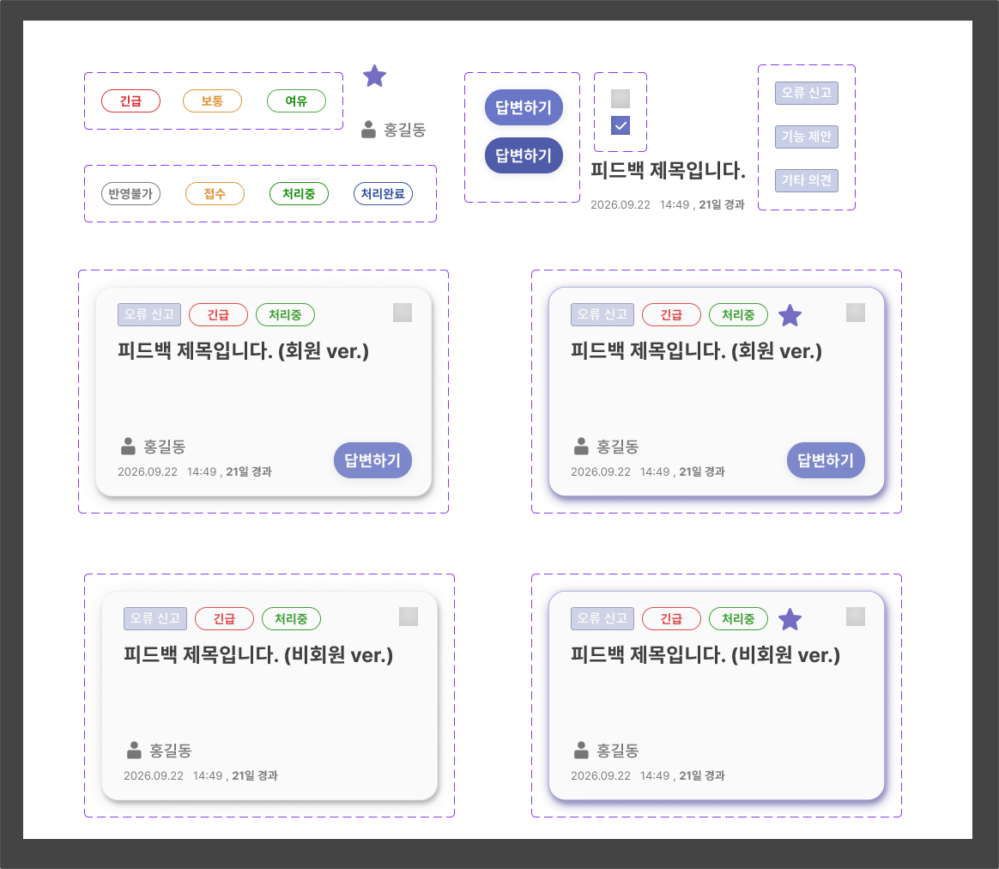

# 피드백 카드와 공용 배지

사용자가 제공한 `피드백게시판 인터페이스 디자인.zip`의 `피드백 카드/뱃지.png`를 기준으로 적용한다.

| 디자인 이름 | 공용 컴포넌트 | 표시 |
|---|---|---|
| Card/Badge/Process | StatusBadge | 접수 주황, 처리 중 초록, 처리 완료 파랑, 반영 불가 회색의 외곽선 배지 |
| Card/Badge/Urgent | PriorityChip | 긴급 빨강, 보통 주황, 여유 초록. 현재 값 하나만 표시 |
| Card/Badge/Sort | CategoryTag | 연보라 바탕의 사각 유형 태그 |
| Card/Badge/Important | PriorityRequestBadge | 보라색 별 |

이번 시안의 상태 배지 색과 중요도 표현은 이전 0-2단계 규칙보다 우선한다. 영문 enum과 한국어 label, props 계약은 유지한다. 차트와 전체 관리자 테마는 별도 범위다.

카드는 둥근 모서리, 밝은 표면, 그림자, 상단 배지와 우측 선택 체크박스, 제목, 하단 작성자와 등록 시각·경과일로 구성한다. 우선 처리 요청 카드는 보라색 외곽선과 그림자로 강조한다. 회원에게만 기존 권한 규칙에 따라 답변 버튼을 제공한다. 비회원의 이름은 API에서 제공하지 않으므로 실제 이름을 만들어 넣지 않고 ‘비회원’으로 표시한다.

담당자, 답변 여부, 상태 변경, 상세 열기, 다중 선택과 드래그 기능은 기존 계약을 유지한다. 긴 제목·좁은 화면에서는 배지와 하단 영역을 줄바꿈한다. 디자인 PNG의 보라색 점선은 편집 도구의 컴포넌트 경계이므로 UI에 넣지 않는다.

스타일 값은 `frontend/src/styles/tokens.css`의 `--feedback-*` 변수로 관리한다. 배지는 `components/common/feedback-badges.css`, 카드 스타일은 `pages/admin/components/feedback-card.css`에 둔다. 기존 관리자 배지 import는 공용 컴포넌트의 재내보내기로 호환한다.
